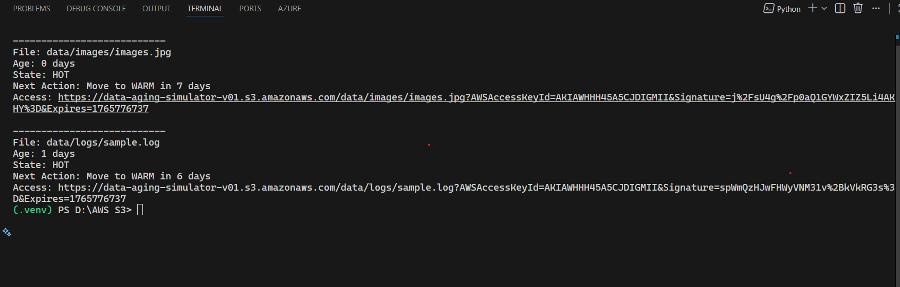
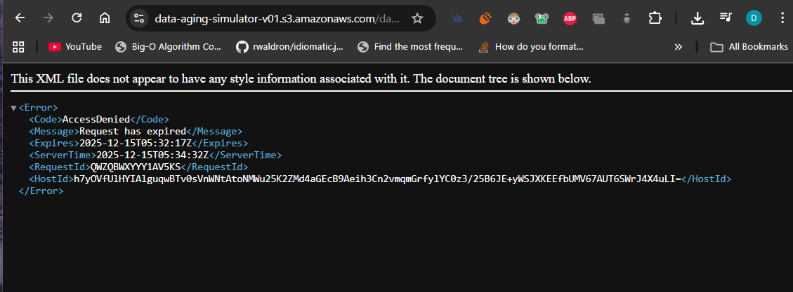
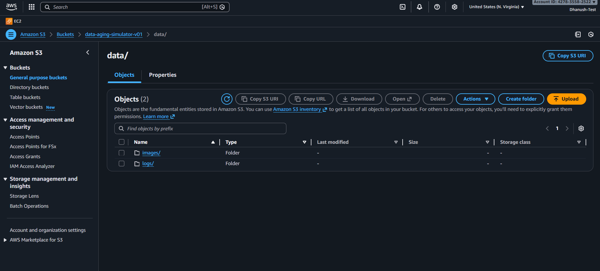

# 📦 S3 Data Aging Simulator

## 🚀 Project Overview
The **S3 Data Aging Simulator** is a cloud-native Python application that demonstrates how real-world systems manage data over time using **AWS S3 lifecycle policies**. Instead of focusing only on file upload and download, this project models how data **ages**, becomes **cold**, and is eventually **expired**, while remaining **secure and cost-efficient**.

This project emphasizes **storage optimization, security, and observability**, which are critical in production cloud systems.

---

## 🎯 Key Features
- Category-based data ingestion (logs, images, backups, reports)
- Automated data aging using S3 lifecycle rules
- Real-time lifecycle inspection (HOT / WARM / COLD / EXPIRED)
- Secure, time-bound access using **Pre-Signed URLs**
- Cost-awareness through storage tier simulation

---

## 🏗️ Architecture

```
User (CLI / App)
   │
   ▼
Python Application
   │
   ├── Upload files with metadata & tags
   ├── Apply lifecycle policies
   ├── Inspect file aging state
   ├── Generate pre-signed URLs
   └── Estimate storage cost impact
   │
   ▼
AWS S3 (Versioned & Lifecycle-Enabled Bucket)
```

---

## 🧠 Data Aging Policy

| Age | State | Storage Class | Action |
|---|---|---|---|
| 0–7 days | HOT | STANDARD | Immediate access |
| 7–30 days | WARM | INTELLIGENT_TIERING | Limited access |
| 30–90 days | COLD | GLACIER | Restricted access |
| 90+ days | EXPIRED | — | Automatically deleted |

---

  

## 🏢 Real-Life Use Case Example: Enterprise Log Archive System

### Scenario
An enterprise application generates large volumes of **application logs** daily. These logs are required for:
- Debugging (recent logs)
- Incident investigation
- Security audits
- Compliance requirements

However, keeping all logs in high-cost storage permanently is inefficient.

---

### How This Project Solves the Problem

#### 1️⃣ Log Ingestion
- Logs are uploaded to S3 under `data/logs/`
- Each log file is tagged and timestamped at upload time

#### 2️⃣ Automated Aging
- Recent logs stay in **HOT storage** for fast access
- Older logs automatically move to **WARM** and **COLD** storage
- Very old logs are **expired** based on retention policy

All transitions are handled automatically by **S3 lifecycle rules**.

#### 3️⃣ Incident Investigation
A security team needs logs from **45 days ago**:
- Logs are now in **GLACIER (COLD state)**
- Bucket remains private and secure

#### 4️⃣ Secure Temporary Access
The system generates a **pre-signed URL** valid for 1 minute:
- No AWS credentials are shared
- No bucket is made public
- Access expires automatically

This ensures **secure, auditable, and controlled access** to sensitive archived data.

---

## ✅ Key Learnings
- How real systems manage data beyond simple storage
- Why lifecycle policies are critical for cost control
- Secure data access without exposing credentials
- Cloud-native thinking using managed services
